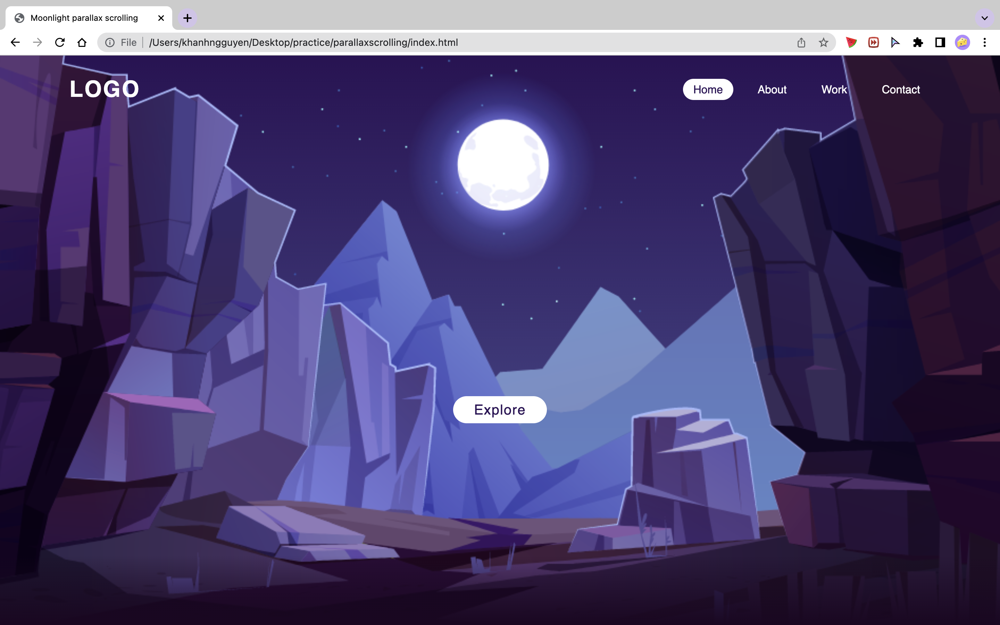
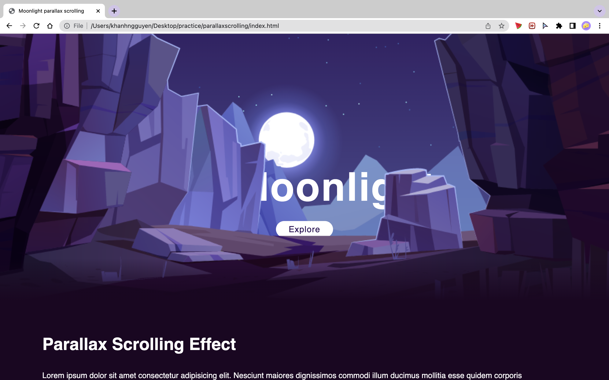

# Parallax scrolling page

## Project brief

Making a parallax scrolling effect on a webpage, using HTML & CSS, and a bit of Javascript

- Tutorials by Online Tutorials, video can be found [here](https://www.youtube.com/watch?v=1wfeqDyMUx4&list=WL&index=79&t=948s)

- Image by upklyak on Freepik, [link](https://www.freepik.com/free-vector/mountains-cleft-view-from-bottom-night-scenery-landscape-with-high-rocks-full-moon-with-stars-glowing-peaks_13194970.htm)

## Outcomes

## Learning outcomes
- Basics of Javascript
- Understand more CSS properties, e.g:
    - `scroll-behavior: smooth;`
    - `overflow: hidden;`
    - position, top, bottom, left, right, z-index

## Known limitations
- Page does not have responsive design